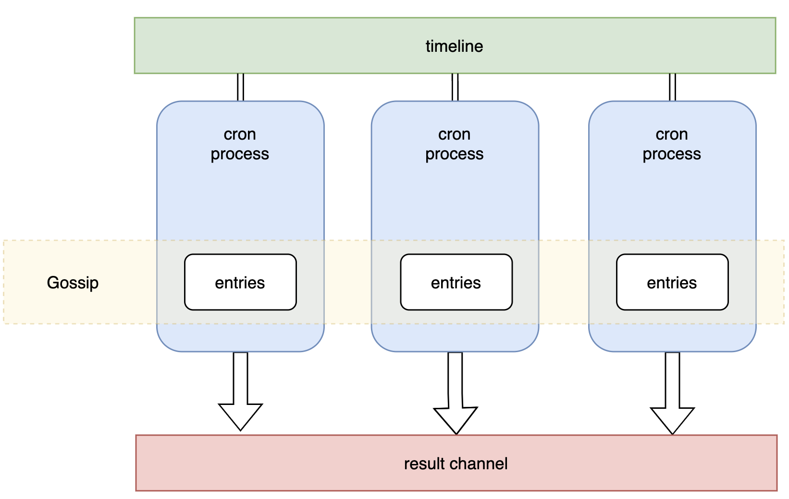

# cron
cron is a simple cron go library

## diagram


## usage

```golang
cli := redis.NewClient(&redis.Options{Addr: "127.0.0.1:6379"})
store := cron.NewRedisKV(cli, "_cron")
timeline := cron.NewRedisTimeline("_cron", cli)
entries := cron.NewGossipEntries(store, config, strings.Split(*nodes, ","))

// consume result chan
result := make(chan string)
go func() {
    for name := range result {
        go func(name string) {
            fmt.Println(" cron.jpgrun task", name)
        }(name)
    }
}()

c := cron.NewCron(timeline, entries, logger, result)
```

`go run examples/main.go --port=8001 --nodes='127.0.0.1:8001,127.0.0.1:8002'`

```shell
2023/03/08 11:23:39 [DEBUG] memberlist: Initiating push/pull sync with:  127.0.0.1:8001
2023/03/08 11:23:39 [DEBUG] memberlist: Stream connection from=127.0.0.1:56192
2023/03/08 11:23:39 [DEBUG] memberlist: Failed to join 127.0.0.1:8002: dial tcp 127.0.0.1:8002: connect: connection refused
DEBU[2023-03-08T11:23:39+08:00] restore 0 events from timeline               
DEBU[2023-03-08T11:23:39+08:00] add: {"name":"t1","spec":"@every 5s"}        
DEBU[2023-03-08T11:23:39+08:00] add: {"name":"t2","spec":"@every 3s"}        
INFO[2023-03-08T11:23:39+08:00] dispense: {"name":"t1","spec":"@every 5s"}   
 cron.jpgrun task t1
INFO[2023-03-08T11:23:39+08:00] dispense: {"name":"t2","spec":"@every 3s"}   
 cron.jpgrun task t2
2023/03/08 11:23:40 [DEBUG] memberlist: Stream connection from=127.0.0.1:56198
INFO[2023-03-08T11:23:43+08:00] dispense: {"name":"t2","spec":"@every 3s"}   
 cron.jpgrun task t2
INFO[2023-03-08T11:23:45+08:00] dispense: {"name":"t1","spec":"@every 5s"}   
 cron.jpgrun task t1
INFO[2023-03-08T11:23:46+08:00] dispense: {"name":"t2","spec":"@every 3s"}   
 cron.jpgrun task t2
INFO[2023-03-08T11:23:50+08:00] dispense: {"name":"t1","spec":"@every 5s"}   
 cron.jpgrun task t1
```

`go run examples/main.go --port=8002 --nodes='127.0.0.1:8001,127.0.0.1:8002'`

```shell
2023/03/08 11:23:40 [DEBUG] memberlist: Initiating push/pull sync with:  127.0.0.1:8001
2023/03/08 11:23:40 [DEBUG] memberlist: Initiating push/pull sync with:  127.0.0.1:8002
2023/03/08 11:23:40 [DEBUG] memberlist: Stream connection from=127.0.0.1:56199
DEBU[2023-03-08T11:23:40+08:00] restore 2 events from timeline               
DEBU[2023-03-08T11:23:40+08:00] add: {"name":"t1","spec":"@every 5s"}        
DEBU[2023-03-08T11:23:40+08:00] add: {"name":"t2","spec":"@every 3s"}        
INFO[2023-03-08T11:23:40+08:00] dispense: {"name":"t1","spec":"@every 5s"}   
 cron.jpgrun task t1
INFO[2023-03-08T11:23:40+08:00] dispense: {"name":"t2","spec":"@every 3s"}   
 cron.jpgrun task t2
INFO[2023-03-08T11:23:49+08:00] dispense: {"name":"t2","spec":"@every 3s"}   
 cron.jpgrun task t2
INFO[2023-03-08T11:23:52+08:00] dispense: {"name":"t2","spec":"@every 3s"}   
 cron.jpgrun task t2
```
