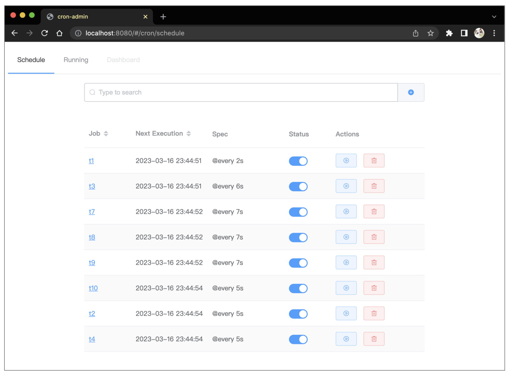

# cron
cron is a simple distributed cron service, you can import it as as library in your application.

## Framework


## Usage

```golang
func main() {
	conf := cron.ParseConfig(*config)
	agent := cron.NewAgent(conf)
	agent.Join(strings.Split(*nodes, ","))

	registerJob(agent)

	agent.Run()
}
```


## Run Example

```
cd examples
go run main.go
```


```
INFO[2023-03-17T17:50:05+08:00] load config ok
DEBU[2023-03-17T17:50:05+08:00] restore 0 events from timeline
2023/03/17 17:50:05 [DEBUG] memberlist: Initiating push/pull sync with:  127.0.0.1:7946
2023/03/17 17:50:05 [DEBUG] memberlist: Stream connection from=127.0.0.1:60697
INFO[2023-03-17T17:50:05+08:00] start admin http server :8080
```


## Config

you can use `--conf=conf.json`  to load config. 

| Key               | Default       | explain                                        |
| ----------------- | ------------- | ---------------------------------------------- |
| redis             | redis.Options |                                                |
| key_timeline      | timeline      | custom timeline key in redis                   |
| key_entry         | _entries      | custom entry key in redis                      |
| key_executor      | _exe          | custom executor key in redis                   |
| max_history_num   | 5             | maximum  number of history for each job        |
| max_output_length | 1000          | maximum output length of each execution of job |
| http_addr         | :8080         |                                                |
| gossip_type       | LAN           | gossip network type                            |
| node_name         | $hostname     |                                                |


## WebUI



