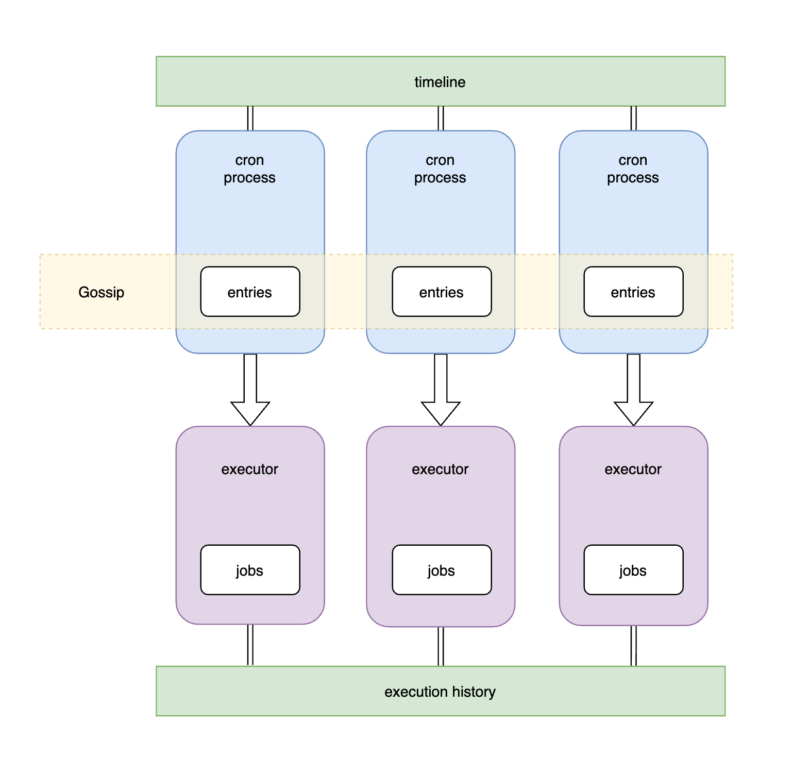

# cron
cron is a simple cron go library

## diagram


## usage

```golang
config := memberlist.DefaultLANConfig()
config.Name = fmt.Sprintf("node_%d", port)
config.BindPort = *port
config.AdvertisePort = *port

cli := redis.NewClient(&redis.Options{Addr: "127.0.0.1:6379"})

agent := cron.NewAgent(
    cli,
    strings.Split(*nodes, ","),
    config,
    logger,
)

agent.AddJob(job{a: "t1"})
agent.AddJob(job{a: "t2"})
agent.AddJob(job{a: "t3"})

agent.Run()

agent.Add("@every 5s", "t1")
agent.Active("t1")
agent.Add("@every 8s", "t2")
agent.Active("t2")
```

`go run examples/main.go --port=8001 --nodes='127.0.0.1:8001,127.0.0.1:8002'`

```shell
2023/03/09 21:10:52 [DEBUG] memberlist: Initiating push/pull sync with:  127.0.0.1:8001
2023/03/09 21:10:52 [DEBUG] memberlist: Stream connection from=127.0.0.1:55346
2023/03/09 21:10:52 [DEBUG] memberlist: Failed to join 127.0.0.1:8002: dial tcp 127.0.0.1:8002: connect: connection refused
DEBU[2023-03-09T21:10:52+08:00] restore 0 events from timeline
DEBU[2023-03-09T21:10:52+08:00] add: {"name":"t1","spec":"@every 5s"}
DEBU[2023-03-09T21:10:52+08:00] add: {"name":"t2","spec":"@every 8s"}
INFO[2023-03-09T21:10:52+08:00] dispense: {"name":"t1","spec":"@every 5s"}
INFO[2023-03-09T21:10:52+08:00] dispense: {"name":"t2","spec":"@every 8s"}
run t1
run t2
2023/03/09 21:10:53 [DEBUG] memberlist: Stream connection from=127.0.0.1:55354
INFO[2023-03-09T21:10:58+08:00] dispense: {"name":"t1","spec":"@every 5s"}
run t1
INFO[2023-03-09T21:11:03+08:00] dispense: {"name":"t1","spec":"@every 5s"}
run t1
INFO[2023-03-09T21:11:08+08:00] dispense: {"name":"t1","spec":"@every 5s"}
run t1
INFO[2023-03-09T21:11:09+08:00] dispense: {"name":"t2","spec":"@every 8s"}
run t2
INFO[2023-03-09T21:11:13+08:00] dispense: {"name":"t1","spec":"@every 5s"}
run t1
INFO[2023-03-09T21:11:17+08:00] dispense: {"name":"t2","spec":"@every 8s"}
run t2


```

`go run examples/main.go --port=8002 --nodes='127.0.0.1:8001,127.0.0.1:8002'`

```shell
2023/03/09 21:10:53 [DEBUG] memberlist: Initiating push/pull sync with:  127.0.0.1:8001
2023/03/09 21:10:53 [DEBUG] memberlist: Initiating push/pull sync with:  127.0.0.1:8002
2023/03/09 21:10:53 [DEBUG] memberlist: Stream connection from=127.0.0.1:55355
DEBU[2023-03-09T21:10:53+08:00] restore 2 events from timeline
DEBU[2023-03-09T21:10:53+08:00] add: {"name":"t1","spec":"@every 5s"}
DEBU[2023-03-09T21:10:53+08:00] add: {"name":"t2","spec":"@every 8s"}
INFO[2023-03-09T21:10:53+08:00] dispense: {"name":"t1","spec":"@every 5s"}
INFO[2023-03-09T21:10:53+08:00] dispense: {"name":"t2","spec":"@every 8s"}
run t1
run t2
INFO[2023-03-09T21:11:01+08:00] dispense: {"name":"t2","spec":"@every 8s"}
run t2
INFO[2023-03-09T21:11:23+08:00] dispense: {"name":"t1","spec":"@every 5s"}
run t1
INFO[2023-03-09T21:11:25+08:00] dispense: {"name":"t2","spec":"@every 8s"}
run t2
INFO[2023-03-09T21:11:28+08:00] dispense: {"name":"t1","spec":"@every 5s"}
run t1
INFO[2023-03-09T21:11:33+08:00] dispense: {"name":"t1","spec":"@every 5s"}
run t1

```
